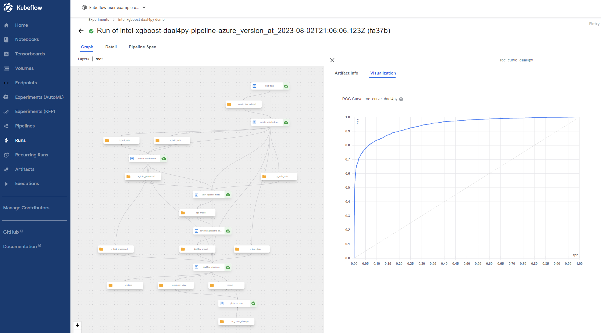
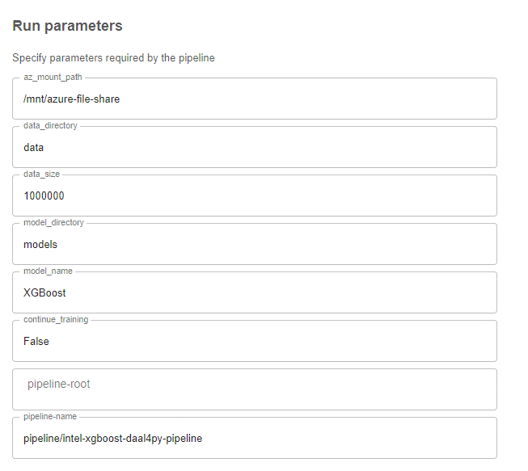

<p align="center">
  
</p>

# Intel® Cloud Optimization Modules for Kubeflow 

© Copyright 2023, Intel Corporation

## XGBoost Daal4py Kubeflow Pipeline

This reference solution provides an optimized training and inference architecture of 
an AI model using XGBoost to predict the probability of a loan default from client 
characteristics and the type of loan obligation. This module enables the use of Intel® 
optimizations for XGBoost and Intel® daal4py in a Kubeflow Pipeline. It also leverages 
secure and confidential computing using Intel® Software Guard Extensions virtual 
machines on an Azure Kubernetes Service (AKS) cluster.

## Table of Contents
- [Solution Overview](#solution-overview)
- [Prerequisites](#prerequisites)
- [Setting up Azure Resources](#setting-up-azure-resources)
- [Installing Kubeflow](#install-kubeflow)
- [Setting up Kubernetes Resources](#setting-up-kubernetes-resources)
- [Running the Kubeflow Pipeline](#running-the-kubeflow-pipeline)
- [Cleaning up Resources](#cleaning-up-resources)

## Solution Overview

The Kubeflow pipeline we will be deploying is based on the 
[Loan Default Risk Prediction AI Reference Kit](https://github.com/oneapi-src/loan-default-risk-prediction).
Below is a graph of the full pipeline.
<p align="center">
  
</p>

The pipeline consists of the following 7 components:  
- **Load data**: This component loads the `credit_risk_dataset.csv` from the Azure 
file share and performs synthetic data augmentation.  
- **Create training and test sets**: This component splits the data into training and test 
sets, of an approximately 75:25 split for model evaluation.  
- **Preprocess features**: This component performs data preprocessing of the training and test 
sets by transforming categorical features using one-hot encoding, imputing missing values, 
and power transforming numerical features.  
- **Train XGBoost model**: This component trains an XGBoost model, or continues training 
the model if selected, and stores the model in the Azure file share.  
- **Convert XGBoost model to Daal4py**: This component converts the XGBoost model to an
inference-optimized daal4py classifier.  
- **Daal4py Inference**:  This component computes predictions using the inference-optimized 
daal4py classifier and evaluates model performance. It returns an output summary of the 
precision, recall, F1 score for each class, as well as the area under the curve (AUC) and 
accuracy of the model.  
- **Plot ROC Curve**: This component performs model validation on the test data 
and generates a graph of the ROC curve.  

## Prerequisites

Before setting up the Azure resources for this module, please ensure you have 
downloaded and installed the required versions of the dependencies
[here](../../README.md#prerequisites).

[Back to Table of Contents](#table-of-contents)

## Setting up Azure Resources

### I. Sign in with the Azure CLI
To sign into your account interactively, use:

```
az login
```

### II. Create a Resource Group
We will first create an 
[Azure Resource Group](https://learn.microsoft.com/en-us/azure/azure-resource-manager/management/overview#resource-groups) 
to hold all of the related resources for our solution. The command below will create 
a resource group named `intel-aks-kubeflow` in the `westus` region.

```
export RG=intel-aks-kubeflow
export LOC=westus

az group create -n $RG -l $LOC
```

### III. Create a File Share
We will use an [Azure File Share](https://learn.microsoft.com/en-us/azure/storage/files/storage-files-introduction) 
for our pipeline's data and model object storage. To create the file share, we will first create an Azure Storage 
Account named `kubeflowstore` using the following command:

```
export STORAGE_NAME=kubeflowstore

az storage account create \
--resource-group $RG \
--name $STORAGE_NAME \
--kind StorageV2 \
--sku Standard_LRS \
--enable-large-file-share \
--allow-blob-public-access false
```

Next, we will create a new file share in our storage account named 
`kubeflow-file-share` with a quota of 1024 GiB.
```
export KUBEFLOW_FILE_SHARE=kubeflow-file-share

az storage share-rm create \
--resource-group $RG \
--storage-account $STORAGE_NAME \
--name $KUBEFLOW_FILE_SHARE \
--quota 1024
```

To upload the credit risk dataset to the file share, we'll create a new
directory called `data` using the command below.
```
export STORAGE_KEY=$(az storage account keys list -g $RG -n $STORAGE_NAME --query [0].value -o tsv)

az storage directory create \
--account-name $STORAGE_NAME \
--share-name $KUBEFLOW_FILE_SHARE \
--name "data" \
--account-key $STORAGE_KEY 
```

Now we'll upload the `credit_risk_dataset.csv` to the data directory.
> **Note**: The credit risk dataset can be downloaded frome Kaggle 
> [here](https://www.kaggle.com/datasets/laotse/credit-risk-dataset). Before executing 
> the command below, ensure the `credit_risk_dataset.csv`
> is located in your current working directory.
```
az storage file upload \
--account-name $STORAGE_NAME \
--share-name $KUBEFLOW_FILE_SHARE \
--source "credit_risk_dataset.csv" \
--path "data/credit_risk_dataset.csv" \
--account-key $STORAGE_KEY 
```

### IV. Create a Container Registry

We'll now create an 
[Azure Container Registry](https://learn.microsoft.com/en-us/azure/container-registry/container-registry-intro) 
to build, store, and manage the container image for our application. The command below 
will create a new container registry named `kubeflowregistry`.

```
export ACR=kubeflowregistry

az acr create --resource-group $RG \
--name $ACR \
--sku Standard
```

Before pushing and pulling container images, first log in to the registry 
using the command below.

```
az acr login -n $ACR
```

Next, we will build the image needed for the Kubeflow pipeline using the Dockerfile 
provided in this repository and push it to the container registry. We will name our 
image `intel-xgboost-daal4py` with the tag `latest`.

```
az acr build --image intel-xgboost-daal4py:latest --registry $ACR -g $RG --file Dockerfile .
```

Run the following command to verify the application image was successfully 
pushed to the repository:

```
az acr repository show -n $ACR --repository intel-xgboost-daal4py -o table
```

Your output should be similar to:
```
CreatedTime                   ImageName              LastUpdateTime                ManifestCount    Registry                     TagCount
----------------------------  ---------------------  ----------------------------  ---------------  ---------------------------  ----------
2023-04-24T21:03:51.1741697Z  intel-xgboost-daal4py  2023-04-24T21:03:51.2592323Z  1                kubeflowregistry.azurecr.io  1
```

### V. Create an AKS Cluster with Intel® Software Guard Extensions (Intel® SGX) Confidential Computing Nodes
Now we're ready to deploy our [Azure Kubernetes Service (AKS)](https://learn.microsoft.com/en-us/azure/aks/intro-kubernetes) cluster with confidential computing nodes leveraging [Intel® Software Guard Extensions (Intel® SGX)](https://www.intel.com/content/www/us/en/developer/tools/software-guard-extensions/overview.html) Virtual Machines (VMs). 

Intel Software Guard Extensions VMs allow you to run sensitive workloads and containers within a hardware-based Trusted Execution Environment (TEE). TEEs allow user-level code from containers to allocate private regions of memory to execute the code with CPU directly. These private memory regions that execute directly with CPU are called enclaves. Enclaves help protect the data confidentiality, data integrity and code integrity from other processes running on the same nodes, as well as Azure operator. These machines are powered by 3rd Generation Intel® Xeon Scalable processors, and use Intel® Turbo Boost Max Technology 3.0 to reach 3.5 GHz.

To set up the confidential computing node pool, we'll first create an AKS cluster with the confidential computing add-on enabled, `confcom`. This will create a system node pool that will host the AKS system pods, like `CoreDNS` and `metrics-server`. Executing the command below will create a node pool with a [`Standard_D4_v5`](https://learn.microsoft.com/en-us/azure/virtual-machines/dv5-dsv5-series) VM. We'll provision a standard [Azure Load Balancer](https://learn.microsoft.com/en-us/azure/aks/load-balancer-standard) for our cluster and attach the container registry we created in the previous step, which will allow our cluster to pull images from the registry.

```
export AKS=aks-intel-sgx-kubeflow

az aks create --resource-group $RG \
--name $AKS \
--node-count 1 \
--node-vm-size Standard_D4_v5 \
--enable-managed-identity \
--generate-ssh-keys -l $LOC \
--load-balancer-sku standard \
--enable-addons confcom \
--attach-acr $ACR
```

To check that the registry was attached to the cluster successfully, run the following command: 
```
az aks check-acr -n $AKS -g $RG --acr kubeflowregistry.azurecr.io
```

Your output should be similar to: 

>[2023-04-24T01:57:25Z] Validating image pull permission: SUCCEEDED  
>[2023-04-24T01:57:25Z]  
>Your cluster can pull images from kubeflowregistry.azurecr.io!


Once the system node pool has been deployed, we'll add the Intel SGX VM node pool to the cluster using an instance of the [DCSv3 series](https://learn.microsoft.com/en-us/azure/virtual-machines/dcv3-series). The name of the confidential node pool is `intelsgx`, which will be referenced when scheduling our pods in the Kubeflow Pipeline.

```
az aks nodepool add --resource-group $RG \
--name intelsgx \
--cluster-name $AKS \
--node-count 2 \
--node-vm-size Standard_DC4s_v3
```

Once the Intel SGX node pool has been added, run the command below to get access credentials to the managed Kubernetes cluster:
```
az aks get-credentials -n $AKS -g $RG
```

To verify that the node pool has been created properly and the SGX-related DaemonSets are running, use the following commands:
```
kubectl config current-context
kubectl get nodes
```

You should see 2 nodes beginning with the name `aks-intelsgx` similar to the output below: 
```
NAME                                STATUS   ROLES   AGE     VERSION
aks-intelsgx-10192822-vmss000000    Ready    agent   2m15s   v1.25.5
aks-intelsgx-10192822-vmss000001    Ready    agent   2m15s   v1.25.5
```

To check that the 
[SGX device plugin](https://github.com/intel/intel-device-plugins-for-kubernetes#sgx-device-plugin) 
has been created properly, run the following command:
```
kubectl get pods -A
```

In the `kube-system` namespace, you should see 2 pods running with the name 
`sgx-plugin` similar to the output below: 
```
kube-system         sgx-plugin-xxxxx                                     1/1     Running   0          4m5s
```

If you see the above node pool and pods running, this means our AKS cluster is now ready to run confidential applications.

[Back to Table of Contents](#table-of-contents)

## Install Kubeflow

Once you've set up the Azure resources for the Pipeline, follow the instructions
to install Kubeflow on the AKS cluster [here](../../README.md#setting-up-kubeflow-on-azure).

[Back to Table of Contents](#table-of-contents)

## Setting up Kubernetes Resources
After installing Kubeflow, we will configure 
[Persistent Volume](https://kubernetes.io/docs/concepts/storage/persistent-volumes/) 
storage for the pipeline using the Azure file share that we created earlier. 

Create a Kubernetes secret containing the Azure storage account name and key:
```
kubectl create secret generic azure-secret \
--from-literal azurestorageaccountname=$STORAGE_NAME \
--from-literal azurestorageaccountkey=$STORAGE_KEY \
--type=Opaque 
```

Change the directory to `kubernetes`:
```
cd ../kubernetes/
```

Create the Persistent Volume and the Persistent Volume Claim:
```
kubectl create -f pv-azure.yaml
kubectl create -f pvc-azure.yaml
```

Verify that the volume was bound to the claim successfully:
```
kubectl get pv pv-azure-file
```

Your output should look similar to:
```
NAME            CAPACITY   ACCESS MODES   RECLAIM POLICY   STATUS   CLAIM                                      STORAGECLASS    REASON   AGE
pv-azure-file   20Gi       RWX            Retain           Bound    kubeflow-user-example-com/pvc-azure-file   azurefile-csi            18d
```

Verify that the claim was bound to the volume successfully:
```
kubectl get pvc pvc-azure-file -n kubeflow-user-example-com
```

Your output should look similar to:
```
NAME             STATUS   VOLUME          CAPACITY   ACCESS MODES   STORAGECLASS    AGE
pvc-azure-file   Bound    pv-azure-file   20Gi       RWX            azurefile-csi   18d
```

[Back to Table of Contents](#table-of-contents)

## Running the Kubeflow Pipeline

### I. Create the Pipeline yaml file

The python code for our pipeline is located in the `src` directory. To generate the yaml file for 
the pipeline, run the following command:

```
cd ..
python3 src/intel_xgboost_daal4py_pipeline.py
```

You should see a new file named `intel-xgboost-daal4py-pipeline.yaml` in the `XGBoost` directory.

### II. Log into the Kubeflow Central Dashboard

1.  In your browser, type in the external IP address of the Istio Ingress Gateway. 
    The DEX login screen should appear.
2.  Enter your username and password. The default username for Kubeflow is 
    `user@example.com` and the default password is `12341234`. Use the password created 
    in [Step I](#i-optional-create-a-unique-password) if completed.  

### III. Run the Pipeline
1.  Once you have logged into Kubeflow, click on the Pipelines tab from the sidebar 
    menu.
2.  Click on the Upload Pipeline button in the top right and type in a new name and 
    description for the Pipeline.
3.  Select Upload a file and navigate to the directory where the 
    `intel-xgboost-daal4py-pipeline.yaml` is located. Click Create.
4.  You should be redirected to a graph overview of the pipeline. In the top right,
    select Create run.
5.  In the Run parameters section at the bottom, you can review and update the default 
    values of the pipeline parameters. For this demo, we will use the parameters shown
    in the image below:

<p align="center">
  
</p>

6.  Click Start to begin running the pipeline.  
7.  When the Pipeline is finished running, check out the **Visualizations** tab for 
    the `Daal4py Inference` and `Plot ROC Curve` steps to view the model metrics.

[Back to Table of Contents](#table-of-contents)

## Cleaning up Resources

Once you're finished running Kubeflow, you can turn off, or stop, the AKS Cluster by using the following command:
```
az aks stop -n $AKS -g $RG
```

When you're ready to delete all of the resources in the Resource Group, run:
```
az group delete -n $RG --yes --no-wait
```

[Back to Table of Contents](#table-of-contents)