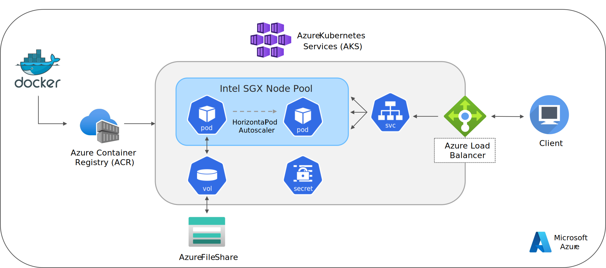

<p align="center">
  
</p>

# Intel® Cloud Optimization Modules for Kubernetes

© Copyright 2023, Intel Corporation
## Microsoft Azure

The Intel® Cloud Optimization Module for Kubernetes* can be used to build and deploy highly available and scalable AI applications on Microsoft Azure. The machine learning component of the module focuses on predicting the probability of a loan default using [Intel® optimizations for XGBoost](https://www.intel.com/content/www/us/en/developer/tools/oneapi/optimization-for-xgboost.html) and [Intel® oneDAL](https://www.intel.com/content/www/us/en/developer/tools/oneapi/onedal.html) to accelerate model training and inference. We also demonstrate how to use incremental training of the XGBoost model as new data becomes available.

The solution architecture uses Docker for application containerization and stores the image in an Azure Container Registry (ACR). The application is then deployed on a cluster managed by Azure Kubernetes Service (AKS). Our cluster runs on confidential computing virtual machines leveraging [Intel® Software Guard Extensions (Intel® SGX)](https://www.intel.com/content/www/us/en/developer/tools/software-guard-extensions/overview.html). We use a mounted Azure File Share for persistent data and model storage. An Azure Load Balancer is provisioned by our Kubernetes service that the client uses to interact with our application.

## Table of Contents
- [Solution Architecture](#solution-architecture) 
- [Loan Default Risk Prediction Application](#loan-default-risk-prediction-application) 
- [Prerequisites](#prerequisites)
- [Setting up Azure Resources](#setting-up-azure-resources)
- [Setting up Kubernetes Resources](#setting-up-kubernetes-application-resources)
- [Deploying the Application](#deploying-the-application)
- [Cleaning up Resources](#cleaning-up-resources)
- [Summary](#summary)

## Solution Architecture

<p align="center">
  
</p>

## Loan Default Risk Prediction Application
The application we will be deploying is based on the [Loan Default Risk Prediction AI Reference Kit](https://github.com/oneapi-src/loan-default-risk-prediction). We have refactored the code from this reference solution to be more modular in support of our three main APIs:

- <b>Data Processing</b> — This endpoint receives the raw CSV file for data preprocessing and stores it in a data lake or another structured format. This codebase also handles the expansion of the dataset for benchmarking purposes.
- <b>Model Training</b> — This endpoint trains an XGBoost classifier and converts it into an inference-optimized [daal4py](https://intelpython.github.io/daal4py/) model.
- <b>Inference</b> — This endpoint receives a sample CSV file and returns the risk prediction of each sample.

The directory tree below outlines the codebase's various scripts, assets, and configuration files. The majority of the ML application code is in the `app/` folder. This folder contains `loan_app` and `utils` packages — the `loan_app` package contains the server-side python modules that support our three main APIs. The `server.py` script contains the FastAPI endpoint configurations, parameters, and commands to start a uvicorn server.

```
├───app/
|   ├───loan_app/
|   |   ├───__init__.py
|   |   ├───data.py
|   |   ├───model.py
|   |   └───predict.py
|   ├───utils/
|   |   ├───__init__.py
|   |   ├───logger.py
|   |   └───storage.py  
|   ├───__init__.py
|   ├───requirements.txt
|   └───server.py    
├───assets/
|   └───architecture.png
├───kubernetes/
|   ├───deployment.yaml
|   ├───hpa.yaml
|   ├───loadbalancer.yaml
|   ├───pv-azure.yaml
|   └───pvc-azure.yaml
|
├─Dockerfile
├─README.md
```
[Back to Table of Contents](#table-of-contents)
## Prerequisites

This module assumes you have a [Microsoft Azure](https://azure.microsoft.com/en-ca) account. While Azure is used for the infrastructure set up, the lessons learned in this module can be applied to other cloud platforms. You can also implement this module on Amazon Web Services (AWS) by following the steps in [this repository](https://github.com/intel/kubernetes-intel-aws-high-availability-training).

### Installations:
- Download and install the [Microsoft Azure CLI](https://learn.microsoft.com/en-us/cli/azure/). 
  - Ensure that you are using version 2.46.0 or above. To find your installation version, run `az version`.
- Download and install the Kubernetes command-line tool, [kubectl](https://kubernetes.io/docs/tasks/tools/).

## Setting up Azure Resources
### I. Sign in with the Azure CLI

To sign into your account interactively, use:
```
az login
``` 
Alternatively, you can also use the [Azure Cloud Shell](https://learn.microsoft.com/en-us/azure/cloud-shell/overview), which automatically logs you in.
### II. Create a Resource Group

We will first create an [Azure Resource Group](https://learn.microsoft.com/en-us/azure/azure-resource-manager/management/overview#resource-groups) to hold all of the related resources for our solution. The command below will create a resource group named `intel-sgx-loan-default-app` in the `westus` region.

```
export RG=intel-sgx-loan-default-app
export LOC=westus

az group create -n $RG -l $LOC
```
### III. Create a File Share
We will be using an [Azure File Share](https://learn.microsoft.com/en-us/azure/storage/files/storage-files-introduction) as persistent volume storage for our application's data and model objects. To create the file share, we will first create an Azure Storage Account named `loanappstorage` using the following command:

```
export STORAGE_NAME=loanappstorage

az storage account create \
--resource-group $RG \
--name $STORAGE_NAME \
--kind StorageV2 \
--sku Standard_LRS \
--enable-large-file-share \
--allow-blob-public-access false 
```

Next, we will create a new file share in our storage account named `loan-app-file-share` with a quota of 1024 GiB.
```
az storage share-rm create \
--resource-group $RG \
--storage-account $STORAGE_NAME \
--name loan-app-file-share \
--quota 1024
```
### IV. Create a Container Registry

We'll now create an [Azure Container Registry](https://learn.microsoft.com/en-us/azure/container-registry/container-registry-intro) to build, store, and manage the container image for our application. The command below will create a new container registry named `loandefaultapp`.

```
export ACR=loandefaultapp

az acr create --resource-group $RG \
--name $ACR \
--sku Standard
```

Log in to the registry using the command below.
```
az acr login -n $ACR
```

Next, we will build our application image from the [Dockerfile](Dockerfile) provided in this repository and push it to the container registry. We will name our image `loan-default-app` with the tag `latest`.
```
az acr build --image loan-default-app:latest --registry $ACR -g $RG --file Dockerfile .
```

Run the following command to verify the application image was successfully pushed to the repository:
```
az acr repository show -n $ACR --repository loan-default-app -o table
```
Your output should be similar to:
```
CreatedTime                   ImageName         LastUpdateTime                ManifestCount    Registry                   TagCount
----------------------------  ----------------  ----------------------------  ---------------  -------------------------  ----------
2023-04-24T21:03:51.1741697Z  loan-default-app  2023-04-24T21:03:51.2592323Z  1                loandefaultapp.azurecr.io  1
```

### V. Create an AKS Cluster with Intel® Software Guard Extensions (Intel® SGX) Confidential Computing Nodes
Now we're ready to deploy our [Azure Kubernetes Service (AKS)](https://learn.microsoft.com/en-us/azure/aks/intro-kubernetes) cluster with confidential computing nodes leveraging [Intel® Software Guard Extensions (Intel® SGX)](https://www.intel.com/content/www/us/en/developer/tools/software-guard-extensions/overview.html) Virtual Machines (VMs). 

Intel Software Guard Extensions VMs allow you to run sensitive workloads and containers within a hardware-based Trusted Execution Environment (TEE). TEEs allow user-level code from containers to allocate private regions of memory to execute the code with CPU directly. These private memory regions that execute directly with CPU are called enclaves. Enclaves help protect the data confidentiality, data integrity and code integrity from other processes running on the same nodes, as well as Azure operator. These machines are powered by 3rd Generation Intel® Xeon Scalable processors, and use Intel® Turbo Boost Max Technology 3.0 to reach 3.5 GHz.

To set up the confidential computing node pool, we'll first create an AKS cluster with the confidential computing add-on enabled, `confcom`. This will create a system node pool that will host the AKS system pods, like `CoreDNS` and `metrics-server`. Executing the command below will create a node pool with a [`Standard_D4_v5`](https://learn.microsoft.com/en-us/azure/virtual-machines/dv5-dsv5-series) VM. The Kubernetes version we are using for this tutorial is 1.25.5. We'll provision a standard [Azure Load Balancer](https://learn.microsoft.com/en-us/azure/aks/load-balancer-standard) for our cluster and attach the container registry we created in the previous step, which will allow our cluster to pull images from the registry.

```
export AKS=aks-intel-sgx-loan-app

az aks create --resource-group $RG \
--name $AKS \
--node-count 1 \
--node-vm-size Standard_D4_v5 \
--kubernetes-version 1.25.5 \
--enable-managed-identity \
--generate-ssh-keys -l $LOC \
--load-balancer-sku standard \
--enable-addons confcom \
--attach-acr $ACR
```

To check that the registry was attached to the cluster successfully, run the following command: 
```
az aks check-acr -n $AKS -g $RG --acr loandefaultapp.azurecr.io
```

Your output should be similar to: 

>[2023-04-24T01:57:25Z] Validating image pull permission: SUCCEEDED  
>[2023-04-24T01:57:25Z]  
>Your cluster can pull images from loandefaultapp.azurecr.io!


Once the system node pool has been deployed, we'll add the Intel SGX VM node pool to the cluster using an instance of the [DCSv3 series](https://learn.microsoft.com/en-us/azure/virtual-machines/dcv3-series). The name of the confidential node pool is `intelsgx`, which will be referenced in the Kuburnetes deployment manifest for scheduling our application pods. We'll enable cluster autoscaling for this node pool and set a minimum of 1 node and a maximum of 5 nodes.

```
az aks nodepool add --resource-group $RG \
--name intelsgx \
--cluster-name $AKS \
--node-count 1 \
--node-vm-size Standard_DC4s_v3 \
--enable-cluster-autoscaler \
--min-count 1 \
--max-count 5
```

Once the Intel SGX node pool has been added, run the command below to get access credentials to the managed Kubernetes cluster:
```
az aks get-credentials -n $AKS -g $RG
```

To verify that the node pool has been created properly and the SGX-related DaemonSets are running, use the following commands:
```
kubectl config current-context
kubectl get nodes
```

You should see a nodepool named `aks-intelsgx` similar to the output below: 
```
NAME                                STATUS   ROLES   AGE     VERSION
aks-intelsgx-10192822-vmss000002    Ready    agent   2m10s   v1.25.5
```

To check that the [SGX device plugin](https://github.com/intel/intel-device-plugins-for-kubernetes#sgx-device-plugin) has been created properly, run the following command:
```
kubectl get pods -A
```

In the `kube-system` namespace, you should see a pod running with the name `sgx-plugin` similar to the output below: 
```
kube-system         sgx-plugin-xxxxx                                     1/1     Running   0          4m5s
```

If you see the above node pool and pod running, this means our AKS cluster is now ready to run confidential applications.

[Back to Table of Contents](#table-of-contents)
## Setting up Kubernetes Application Resources

### I. Create a Kubernetes Namespace

Now that our AKS cluster has been deployed, we'll use the command below to set up a namespace for our cluster resources called `intel-sgx-loan-app`.
```
export NS=intel-sgx-loan-app
kubectl create namespace $NS
```

To check that the namespace was created successfully, use:
```
kubectl get ns
```

You should see the following namespaces in your cluster:
```
NAME                 STATUS   AGE
default              Active   29h
gatekeeper-system    Active   29h
intel-sgx-loan-app   Active   28h
```

### II. Create a Kubernetes Secret

Next, we'll create a secret with our storage account name and account key so that we can mount the `loan-app-file-share` to our application pods.
```
export STORAGE_KEY=$(az storage account keys list -g $RG -n $STORAGE_NAME --query [0].value -o tsv)

kubectl create secret generic azure-secret \
--from-literal azurestorageaccountname=$STORAGE_NAME \
--from-literal azurestorageaccountkey=$STORAGE_KEY \
--type=Opaque 
```

### III. Create Kubernetes Persistent Volume Storage

Now that we've created a secret for our Azure storage account, we can set up persistent volume storage for our application. A [Persistent Volume (PV)](https://kubernetes.io/docs/concepts/storage/persistent-volumes/) will enable our application's data to persist beyond the lifecycle of the pods and allow each of the pods in our deployment to access and store data in the `loan-app-file-share`. 

We'll first create the persistent volume using the `pv-azure.yaml` file. This will create a storage resource available in the cluster backed by our Azure file share. We'll then create the persistent volume claim (PVC) using the `pvc-azure.yaml` file, which will request 20Gi of storage from the `azurefile-csi` storage class with `ReadWriteMany` access. Once the claim matches with our volume, they will be bound together in a one-to-one mapping.
```
kubectl create -f kubernetes/pv-azure.yaml -n $NS
kubectl create -f kubernetes/pvc-azure.yaml -n $NS
```

To check that the Persistent Volume was bound to the claim successfully, run:
```
kubectl get pv -n $NS
```

Your output should be similar to: 
```
NAME                    CAPACITY   ACCESS MODES   RECLAIM POLICY   STATUS   CLAIM                                       STORAGECLASS    REASON   AGE
loan-app-pv-azurefile   20Gi       RWX            Retain           Bound    intel-sgx-loan-app/loan-app-pvc-azurefile   azurefile-csi            22m
```

To check that the Persistent Volume Claim was bound to the volume successfully, run:
```
kubectl get pvc -n $NS
```

Your output should be similar to: 
```
NAME                     STATUS   VOLUME                  CAPACITY   ACCESS MODES   STORAGECLASS    AGE
loan-app-pvc-azurefile   Bound    loan-app-pv-azurefile   20Gi       RWX            azurefile-csi   22m
```

### IV. Create a Kubernetes Load Balancer

Now that our storage is set up, we'll create a [Load Balancer Service](https://kubernetes.io/docs/tasks/access-application-cluster/create-external-load-balancer/) to distribute incoming API calls evenly across the available pods in the cluster, which will help to ensure our application remains highly available and scalable. Running the command below will configure an Azure Load Balancer for our cluster with a new public IP that we will use to send requests to the application's API endpoints for data processing, model training, and inference.
```
kubectl create -f kubernetes/loadbalancer.yaml -n $NS
```

To check that the load balancer was created successfully, run:
```
kubectl get svc -n $NS
```

Your output should be similar to:
```
NAME                     TYPE           CLUSTER-IP   EXTERNAL-IP      PORT(S)          AGE
loan-app-load-balancer   LoadBalancer   10.0.83.32   20.xxx.xxx.xxx   8080:30242/TCP   42s
```

### V. Create a Kubernetes Deployment
Now we're ready to deploy the first pod for our application. We will initially set up one pod and use the [Horizontal Pod Autoscaler (HPA)](https://kubernetes.io/docs/tasks/run-application/horizontal-pod-autoscale/) to scale up and scale down additional pods as needed. To create and manage our application pods, we will use a [Kubernetes Deployment](https://kubernetes.io/docs/concepts/workloads/controllers/deployment/). A Kubernetes Deployment is a Kubernetes resource that allows you to declaratively manage a set of replica pods for a given application, ensuring that the desired number of pods are running and available at all times. In the pod template of the deployment spec, we will specify that our pods only be scheduled on a node in the Intel SGX node pool. If an SGX node is not available, the cluster will automatically scale up to add an additional SGX node. We will also specify the directory in our pod where the volume will be mounted to, which will be in the `loan_app/azure-file` directory. When the pod is scheduled, the cluster will inspect the persistent volume claim to find the bound volume and mount the Azure file share to our pod.
> **Note**: Before executing the command below, you will need to update the container image field in the `deployment.yaml` file with the name of the Azure Container Registry, repository, and tag, e.g., `loandefaultapp.azurecr.io/loan-default-app:latest`.
```
kubectl create -f kubernetes/deployment.yaml -n $NS
```

To check that the deployment was created successfully, we can use the [`kubectl get`](https://kubernetes.io/docs/reference/generated/kubectl/kubectl-commands#get) command:
```
kubectl get all -n $NS
```

Your output should be similar to:
```
NAME                                READY   STATUS    RESTARTS   AGE
pod/sgx-loan-app-5948f49746-zl6cf   1/1     Running   0          81s

NAME                             TYPE           CLUSTER-IP   EXTERNAL-IP      PORT(S)          AGE
service/loan-app-load-balancer   LoadBalancer   10.0.83.32   20.xxx.xxx.xxx   8080:30242/TCP   3m40s

NAME                           READY   UP-TO-DATE   AVAILABLE   AGE
deployment.apps/sgx-loan-app   1/1     1            1           81s

NAME                                      DESIRED   CURRENT   READY   AGE
replicaset.apps/sgx-loan-app-5948f49746   1         1         1       81s
```
> **Note**: You can use `kubectl logs <pod-name> -n $NS --follow` to stream the logs from the pod.

### VI. Create a Kubernetes Horizontal Pod Autoscaler

Finally, we'll create a Horizontal Pod Autoscaler (HPA) for our application that will maintain between 1 and 5 replicas of the pods. The HPA controller will increase and decrease the number of replicas (by updating the Deployment) to maintain an average CPU utilization of 50%. Once CPU usage by the pods goes above 50%, a new pod will automatically be scheduled.
```
kubectl create -f kubernetes/hpa.yaml -n $NS
```

To check that the HPA was created successfully, run:
```
kubectl get hpa -n $NS
```

Your output should be similar to:
```
NAME                      REFERENCE                 TARGETS   MINPODS   MAXPODS   REPLICAS   AGE
loan-app-pod-autoscaler   Deployment/sgx-loan-app   0%/50%    1         5         1          40s
```
> **Note**: You can use `kubectl get hpa -n $NS --watch` to view HPA updates.

[Back to Table of Contents](#table-of-contents)
## Deploying the Application

Now that our Azure resources and Kubernetes infrastructure has been set up, we can send requests to our application's endpoints. The three main endpoints in our application are data processing, model training, and inference. We'll use the cURL commands below to make our API calls to each endpoint.

### Data Processing

The Data Processing endpoint receives the original credit risk CSV file, creates a data preprocessing pipeline, and generates a training and test set of the size specified. The train/test data and our preprocessor are then stored in the Azure file share. The endpoint accepts the following 4 parameters:  
- <b>`az_file_path`</b>: The volume mount path to the Azure file share for object storage.   
- <b>`data_directory`</b>: The directory in the file share where processed data should be stored.   
- <b>`file`</b>: The original credit risk CSV file located in the working directory.   
- <b>`size`</b>: The desired size of final dataset, default 4M rows.   
> **Note**: The data used in this module can be downloaded from Kaggle [here](https://www.kaggle.com/datasets/laotse/credit-risk-dataset).

You can make a call to the Data Processing endpoint using the command below with the external IP address that was created by the Azure load balancer.
```
curl <external-IP>:8080/data_processing \
-H "Content-Type: multipart/form-data" \
-F az_file_path=/loan_app/azure-fileshare \
-F data_directory=data \
-F file=@credit_risk_dataset.csv \
-F size=4000000 | jq 
```

Your output should be similar to:
```bash
  % Total    % Received % Xferd  Average Speed   Time    Time     Time  Current
                                 Dload  Upload   Total   Spent    Left  Speed
100 1762k    0    70  100 1762k      0  18643  0:01:36  0:01:36 --:--:--    15
{
  "Message": "credit_risk_dataset.csv successfully processed and saved"
}
```
In the `loan-app-file-share`, you should see a new directory named `data` with the processed training and test sets as well as the data preprocessor.

### Model Training

Now we're ready to train our XGBoost model. We will make a request to the Model Training endpoint, which will begin training the model, or continue training the model, depending on the value of the `continue_training` parameter. The XGBoost classifier and the model validation results are then stored in the Azure File Share. This endpoint accepts the following 6 parameters:  
- <b>`az_file_path`</b>: The volume mount path to the Azure file share.   
- <b>`data_directory`</b>: The directory in the file share where processed data is stored.   
- <b>`model_directory`</b>: The directory in the file share for model storage.  
- <b>`model_name`</b>: The name to store the model object.  
- <b>`continue_training`</b>: The XGBoost model parameter for training continuation.   
- <b>`size`</b>: The size of the processed dataset.   

You can make a call to the Model Training endpoint using the command below:
```
curl <external-IP>:8080/train \
-H "Content-Type: multipart/form-data" \
-F az_file_path=/loan_app/azure-fileshare \
-F data_directory=data \
-F model_directory=models \
-F model_name=XGBoost \
-F continue_training=False \
-F size=4000000 | jq
```

Your output should be similar to:
```bash
  % Total    % Received % Xferd  Average Speed   Time    Time     Time  Current
                                 Dload  Upload   Total   Spent    Left  Speed
100  1373  100   667  100   706      7      8  0:01:35  0:01:23  0:00:12   188
{
  "Message": "XGBoost model succesfully trained and saved",
  "Validation Scores": {
    "precision": {
      "Non-Default": 0.9506899074608538,
      "Default": 0.9663244955738747,
```
In the `loan-app-file-share`, you should see a new directory named `models` with the XGBoost model saved as `.joblib` object along with the model results.

#### Continue Training the XGBoost Model
To demonstrate training continuation of our XGBoost model, we will first process a new batch of 1,000,000 rows of data using the command below:
```
curl <external-IP>:8080/data_processing \
-H "Content-Type: multipart/form-data" \
-F az_file_path=/loan_app/azure-fileshare \
-F data_directory=data \
-F file=@credit_risk_dataset.csv \
-F size=1000000 | jq 
```

We will then call the model training endpoint with the `continue_training` parameter set to `True`.
```
curl <external-IP>:8080/train \
-H "Content-Type: multipart/form-data" \
-F az_file_path=/loan_app/azure-fileshare \
-F data_directory=data \
-F model_directory=models \
-F model_name=XGBoost \
-F continue_training=True \
-F size=1000000 | jq
```

### Inference

Finally, we can use our trained XGBoost classifier to predict the likelihood of a loan default by calling our Inference endpoint. The request to this endpoint will retrieve the trained XGBoost model from the Azure file share and convert it into a daal4py format to perform model inference. The inference results are then stored in the loan app file share, containing the predicted probabilities and a corresponding label of True when the probability is greater than 0.5 or False otherwise. The endpoint accepts a CSV file with sample data in the same format as the credit risk data in addition to the following parameters:  
- <b>`file`</b>: The sample CSV file for model inference.  
- <b>`az_file_path`</b>: The volume mount path to the Azure file share.   
- <b>`data_directory`</b>: The directory in the file share where the data preprocessor is stored.   
- <b>`model_directory`</b>: The directory in the file share where the trained XGBoost model is stored.  
- <b>`model_name`</b>: The name of the stored model object.  
- <b>`sample_directory`</b>: The directory in the file share to save the prediction results.  

You can make a call to the Inference endpoint using the command below:
```
curl <external-IP>:8080/predict \
-H "Content-Type: multipart/form-data" \
-F file=@sample.csv \
-F az_file_path=/loan_app/azure-fileshare \
-F data_directory=data \
-F model_directory=models \
-F model_name=XGBoost \
-F sample_directory=samples| jq
```

Your output should be similar to:
```bash
  % Total    % Received % Xferd  Average Speed   Time    Time     Time  Current
                                 Dload  Upload   Total   Spent    Left  Speed
100  1210  100   159  100  1051     50    332  0:00:03  0:00:03 --:--:--   383
{
  "Message": "Model Inference Complete",
  "Prediction Output": {
    "Probability": {
      "0": 0.9884715544917589,
      "1": 0.9896255082856604
```

In the `loan-app-file-share`, you should see a new directory named samples with the Daal4py prediction results saved in a CSV file.  

[Back to Table of Contents](#table-of-contents)

## Cleaning up Resources

Once we are finished running our application, we can turn off, or stop, the AKS Cluster using the following command:
```
az aks stop -n $AKS -g $RG
```

When you're ready to delete all of the resources in the Resource Group, run:
```
az group delete -n $RG --yes --no-wait
```

[Back to Table of Contents](#table-of-contents)

## Summary

In this tutorial, we have demonstrated how to build a highly available and scalable Kubernetes application on the Azure cloud, leveraging Intel SGX Confidential Computing nodes. Our solution architecture implemented the Loan Default Risk Prediction Reference Kit, which built an XGBoost classifier capable of predicting the probability that a loan will result in default using Intel® optimizations in XGBoost and Intel® oneDAL to accelerate training and inference. We further demonstrated how an XGBoost classifier can be updated with new data, training incrementally, which aims to tackle challenges such as data shift and very large datasets. You can view the performance results of the Loan Default training and inference experiments [here](https://github.com/oneapi-src/loan-default-risk-prediction#training-experiments). 

[Back to Table of Contents](#table-of-contents)